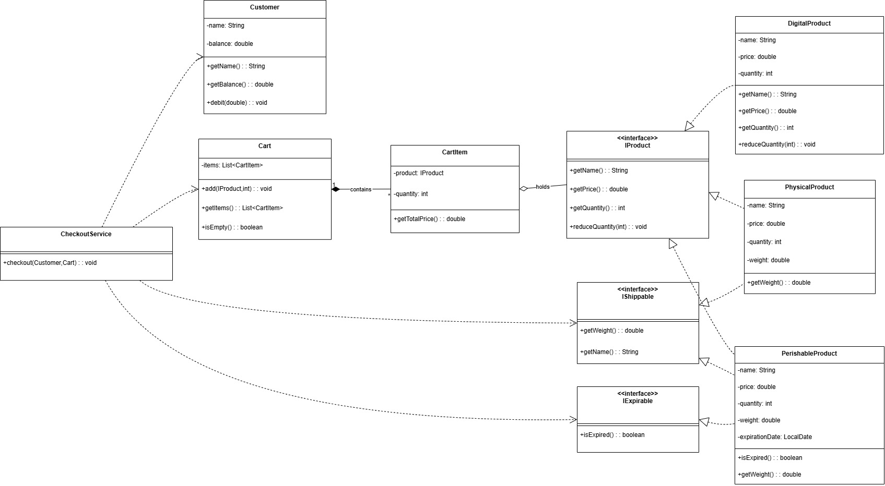

# Simple E‑commerce by Java

A console‑based e‑commerce system demonstrating key OOP concepts, SOLID design principles, Organized into clear layers (model, service, exception), built with Java 21 in IntelliJ IDEA.

## Class Diagram



---

## 📂 Package Structure

```
E-Commerce/src/
└── main/
    └── java/
        └── org.example/
            ├── model/
            │   ├── Product.java
            │   ├── Customer.java
            │   ├── Shippable.java
            │   └── ProductFactory.java
            ├── service/
            │   ├── Cart.java
            │   ├── ECommerce.java
            │   └── ShippingService.java
            ├── exception/
            │   ├── EmptyCartException.java
            │   ├── OutOfStockException.java
            │   ├── ExpiredProductException.java
            │   └── InsufficientFundsException.java
            └── Main.java
```
---

## 🎯 Object‑Oriented Design

This project leverages core OOP concepts:

* **Encapsulation**: Classes hide internal details and expose only necessary methods (e.g., `Product.reduceQuantity(...)`).
* **Abstraction**: The `Shippable` interface defines a contract; `ECommerce` and `ShippingService` operate on this abstraction without knowing product internals.
* **Inheritance & Polymorphism**: All shippable products implement `Shippable`, enabling interchangeable treatment at runtime.
* **Modularity & Reusability**: Clear separation allows adding new product types or services with minimal changes.

---

## 🔧 SOLID Principles

1. **Single Responsibility**: One class ⇒ one job (e.g., `Cart` only manages item selection).
2. **Open/Closed**: Extend behavior by adding new `Shippable` implementations or exception types—no code modification needed.
3. **Liskov Substitution**: Any `Shippable`-implementing object works seamlessly in shipping logic.
4. **Interface Segregation**: Only products requiring shipping implement `Shippable`; others remain simple.
5. **Dependency Inversion**: High‑level modules (`ECommerce`) depend on abstractions (`Shippable`), not on concrete classes.

---

## 🔄 Design Pattern: Strategy & Factory

* **Strategy**: The `Shippable` interface is our strategy. Different products supply their own weight logic, and `ShippingService` applies a consistent shipping algorithm.
* **Factory**: `ProductFactory` centralizes creation of perishable vs. digital products, hiding construction details and improving readability.
